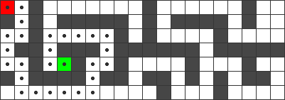
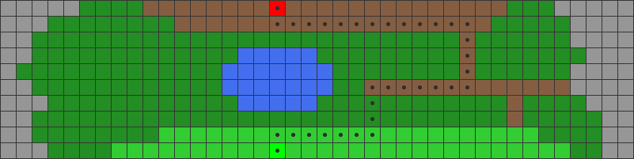

# A* Pathfinder
## The solution
### Grids with Obstacles
Finds the shortest paths in grids with obstacles. The algorithm searches from the start cell *(red)* to the goal cell *(green*).

### Grids with Different Cell Costs
The squares on the board have different costs, symbolizing the time it takes to pass different types of landscapes like mountains and forests. Crossing a mountain takes longer time than crossing grass, meaning a mountain has a higher cost.

| Landscape     | Cost  | Color       |
| ------------- |:-----:| ----------- |
| Water         | 100   | Blue        |
| Mountains     | 50    | Gray        |
| Forests       | 10    | Dark green  |
| Grass         | 5     | Light green |
| Roads         | 1     | Brown       |

The algorithm finds the path with the lowest cost.

## How to run
### Requirements
The package `pillow` has to be installed.

### A*
1. Run a_star.py

### Dijkstra
1. Edit line 4 in `algorithm_comparison.py` to *DIJKSTRA*
2. Run algorithm_comparison.py

### BFS
1. Edit line 4 in `algorithm_comparison.py` to *BFS*
2. Run algorithm_comparison.py

## How to change board
1. Edit line 4/5 to the desired .txt file
